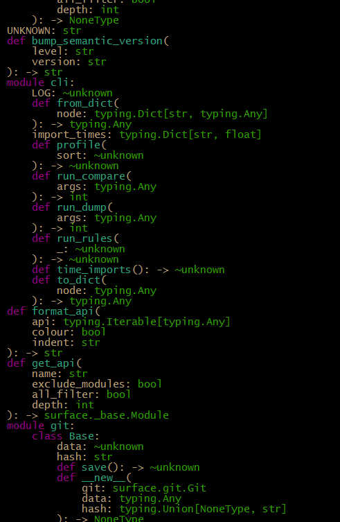

## Surface those API breaking changes!


Surface is a tool to facilitate exposing, inspecting and diffing the public API of your module.
Run it on your project to see at a glance what you are exposing to the world. Run it on your CI to prevent breaking API changes.

Example:

```sh
>>> surface dump surface
```



The comparison aspect of this project is to assist in following semantic versioning. https://semver.org/
To that end, it can pick up on changes to the API and suggest version changes. eg patch, minor, major
It also features options to lock down an api on CI. eg: exit 1 if major change is detected.


A rough usage example can be found on this very projects CI (.travis.yml), checking the script version matches the observed changes.

```sh
# Install latest public release, scan API and get version
>>> pip install surface
>>> surface -q dump surface -o before.json
>>> RELEASE_VER="$(surface -V 2>&1)"
# Install local release candidate, scan API and get version
>>> pip install -e ./
>>> surface -q dump surface -o after.json
>>> DEV_VER="$(surface -V 2>&1)"
# Determine next release version
>>> PREDICTED_VER="$(surface compare before.json after.json -b $RELEASE_VER)"
# Check the versions match and fail if they do not
>>> echo $PREDICTED_VER | grep $DEV_VER || (echo Version missmatch. Wanted $PREDICTED_VER but got $DEV_VER && exit 1)
```

There are many more options available to craft something for your use case. Have a peek below.

## Usage:

### Dump:

This subcommand will import and scan the provided api. Then output a representation of what it finds to where you specify.

* (--recurse) Walk through, and run on submodules.
* (--depth NUM) Only traverse objects to this depth. (default 5)
* (--exclude-modules) Don't traverse imported modules. This (and the above) are helpful if the api is messy/large, and takes a long time to scan.
* (--all-filter) Respect `__all__` attrbiute. Treat the public api as though it were being imported with *.
* (--pythonpath PATH) Additions to the python path. These paths will be prepended and used for lookup when running.
* (--output PATH) File (.json) in which to save the scanned info. Useful for comparisons / manual inspection later.
* (--git REPO) Alternative to --output. Will put the command in git mode. Changes will be stored in a git repo at the provided path (one will be created if it does not exist) into the branch surface_API_store. Linked to the commit-hash for the current commit in the current working directory. If you want to include this in the current repo, just pass `--git ./` as the argument.

```sh
surface dump --output /path/to/output.json module_to_scan

surface dump --git /path/to/repo/storage module_to_scan
```

### Compare:

This subcommand will take two previously exported (above) files, and compare their changes. Outputting what it sees.

* (--bump VERSION) Instead of outputting a semantic level. It will instead take a version, and output the version with the level applied. eg --bump 1.2.3 instead of minor would become 1.3.0
* (--check LEVEL) Disallow this level (or higher). exit 1 if it exceeds the level. Useful for CI jobs to prevent breaking changes.
* (--git PATHS) Git mode. Treat 'old' and 'new' inputs as git identifiers (eg branches). Look for the corresponding data in repos at the provided paths, previously saved with the above gitmode.
* (--merge) Git mode. Instead of taking two identifiers and comparing directly. Take the commit at merge-base between the two. This is helpful to compare what changed since the branch diverged.

```sh
surface compare /path/to/old/scan.json /path/to/new/scan.json

surface compare --git /path/to/repo/store master HEAD
```

### Common options:

Common options that affect all subcommands.

* (--help) Display help message.
* (--rules) Print out a list of rules the tool adheres to.
* (--no-colour) Do not include ansii colours in output.
* (--quiet) Silence the reporting output.

There are some built in dev tools also.

* (--profile SORT) Run a profiler, and sort output by provided column.
* (--debug) Enable debug logging.
* (--pdb) Launch PDB on exceptions.


_This is somewhat a Work In Progress. Don't rely on it in production. (That said, feel free to test and report findings)._


Rough todo...
- [x] Get basic functionality up and running.
- [x] Handle recursive imports (if nessisary).
- [x] Collect Live typing information.
- [x] Collect annotation typing information.
- [x] Partial support for typing comments.
- [x] Partial support for docstring typing (google style only, currently)
- [x] Ignore changes from typing.* objects, imported locally. Perhaps ignore from initial scan.
- [ ] Search modules from bottom up. So "parent" relationships reflect module heirarchy, not traversal chain.
- [x] Utilize sigtools depth feature, to collect typing from comments on all arguments.
- [x] Improve typing comparison. Inspecting deeply nested types.
- [x] Provide features to store api output using git commits
- [x] Evaluate typing to ensure we get a live type, and correct paths etc
- [x] Move some of the cli utility stuff into its own submodule (public).
- [x] clean stuff up
- [x] When comparing types, check if they line up with an exposed alias.
- [x] use import hook to track import time properly (nice to have)
- [x] Compare Union correctly. Order of entires does not matter, and has an alias: Optional[something]
- [x] Same thing with NoneType and None. Both are equal.
- [x] Unknown have a type field for comparisons. Instead of full text comparison.
- [ ] More and more and more tests.
